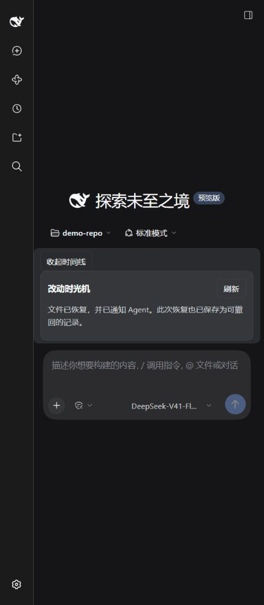

# 改动时光机 · DSH Time Machine

**给 DeepSeek Harness 加一个撤回按钮：看清这一轮改了什么，再选择要恢复的文件。**

面向 DeepSeek Harness 的第三方插件。按官方 bundle、Cordis 生命周期和 Web 客户端模块规范实现，无需修改 DSH 源码。非 DeepSeek 官方出品。

[下载 v0.1.0](https://github.com/icyaaaww/dsh-time-machine/releases/tag/v0.1.0) · [反馈问题](https://github.com/icyaaaww/dsh-time-machine/issues) · [English](README.md)

<details>
<summary>展开真实 DSH Web 验收截图</summary>



截图使用确定性测试检查点；自动轮次捕获由生产服务集成测试覆盖。
</details>

## 功能

- 自动记录顶层 Agent 每轮开始前和结束后的本地 Git 工作区文本文件内容。
- 记录持久化到工作区之外，关闭 DSH 后仍可查看。
- 中文/英文 Web 入口、时间线卡片、文件差异、检查点命名。
- 整轮撤回或选择部分文件；先预览，确认后才执行。
- 后续内容或权限发生变化即拒绝撤回，保留用户原有未提交工作。
- 恢复本身也形成一条记录，可以再撤回恢复。
- 写入前保存恢复日志；中断后可以回滚已应用部分，不覆盖不匹配的后续编辑。
- 成功恢复后向 Agent 的持久 inbox 注入提示，要求重新检查文件；保留原聊天记录。

## 兼容版本

第一版针对并精确声明 DSH `0.2.1-alpha.1`、Cordis `4.0.5-alpha.1`。Node.js 24+、Git 必需。本地 Git 工作区支持 Windows、macOS、Linux；本次运行验证在 Windows 完成。其他平台需再验收。

精确版本来自本次审查的官方源码和已发布包。其他 DSH 版本可能拒绝安装，这是 pre-stable API 的兼容保护；不要直接放宽 peerDependencies 或使用版本豁免来宣称兼容。

## 安装预构建包

先从 [GitHub Release](https://github.com/icyaaaww/dsh-time-machine/releases/tag/v0.1.0) 下载 `dsh-time-machine-0.1.0.tgz`，然后在 DSH CLI 所在终端执行，把路径替换为下载的文件：

```powershell
dsh plugin --profile web add "C:\path\dsh-time-machine-0.1.0.tgz"
dsh --profile web --dump-config
```

已有 Web 进程在安装后重新启动。配置树中应出现 `time-machine`。桌面版请通过桌面应用自己的插件管理入口安装到其 desktop profile，不要用不匹配版本的外部 CLI 改写 desktop profile。

此 tarball 包含编译产物，不依赖安装时构建脚本。无需 API key 即可查看记录、预览和恢复；Agent 执行任务仍使用你原有的模型设置。

卸载：

```powershell
dsh plugin --profile web remove dsh-time-machine
```

卸载撤销界面和命令注册，但保留快照。现有聊天中的命令结果可由默认命令卡片继续显示。没有增加第三方专属 Session 事件类型，减少卸载后的日志读取依赖。

## 使用

1. 在本地 Git 项目中打开会话，让 Agent 完成一次文件修改。
2. 点击输入框附近的「查看改动时间线」。Agent 应处于空闲状态。
3. 在对应轮次点「查看差异 / 撤回预览」。差异展示的是原始修改方向，撤回会恢复到修改前。
4. 可以取消勾选部分文件，然后点「仅预览所选文件」生成新的预览。
5. 确认范围后点「确认撤回所选文件」。有冲突时按钮不可用，Host 也会再次检查。
6. 要撤销刚才的恢复，刷新时间线，对新的 Undo 记录再次预览、撤回。

检查点名称只是记录标签，不创建 Git commit。每条记录包含该轮发生变化的文件，撤回恢复的是这些文件的 **before** 内容，不是把整个仓库强行切换到某个历史 commit。

斜杠命令同样可用：

```text
/time_machine
/time_machine list
/time_machine preview <checkpoint-id>
/time_machine undo <preview-token>
/time_machine name <checkpoint-id> 当前能运行的版本
/time_machine recover
```

命令路径也要求先获取预览。预览 token 绑定当前会话和进程、默认五分钟有效、只能使用一次。刷新页面或重新启动后请重新预览。

## 配置

在 profile 的 `cordis.patch.yml` 覆盖插件的 config。官方 patch 替换整份 config；未填写的字段由本插件 schema 补默认值。

```yaml
- id: time-machine
  config:
    storageRoot: 'D:/dsh-time-machine-data'
    maxFileBytes: 2097152
    maxFiles: 5000
    maxStoreBytes: 536870912
    maxRecords: 2000
    timeoutMs: 30000
    maxDiffChars: 60000
    previewTtlMs: 300000
```

`storageRoot` 为空时使用 `$DSH_HOME/plugins/time-machine`，未设置环境变量时使用 `~/.dsh/plugins/time-machine`。若启动器使用独立的 home 参数但没有设置环境变量，请显式配置 storageRoot。存储目录必须位于 Git 仓库之外。

容量和记录上限按仓库分别计算。到达上限后停止新增快照/恢复记录，旧记录仍可读取；第一版不自动删除用户检查点。目录包含源代码历史，应按项目机密资料管理。POSIX 新建文件使用 owner-only 权限；Windows 继承父目录 ACL。

## 官方插件规范对应

| 官方机制 | 本插件 |
|---|---|
| `dsh.bundle.patch` | `cordis.patch.yml` 插入 `dsh-time-machine` |
| 函数插件 | 命名导出 `name`、`inject`、`Config`、`apply`，无 default export |
| 同实例 DSH 依赖 | 同时声明 peerDependencies 和 devDependencies |
| 可释放注册 | effect 管理命令和监听器；卸载等待任务结束 |
| Web 模块 | `dsh.client`、`./client` export、官方 lazy-CJS factory 格式 |
| UI 扩展 | `conversation.input.dock` 和 keyed `conversation.chat.commandview` |
| 持久命令结果 | 复用官方 `command/run`、`command/done` |
| 模型可见上下文 | 通过 `agent.inject()` 进入持久 inbox，并 flush Session |
| 本地化 | typed 中英文词典和 locale 元信息 |
| 安装分发 | 编译后 tarball，无安装时脚本 |

依据：[官方打包与安装规范](https://github.com/deepseek-ai/deepseek-harness/blob/5badb15009ae1756c3afe0ae0cef1faafc290ccc/docs/user/develop/basic/publish.md)、[客户端扩展格式](https://github.com/deepseek-ai/deepseek-harness/blob/5badb15009ae1756c3afe0ae0cef1faafc290ccc/docs/cookbook/adding-a-settings-card.md)。

## 开发与验证

```text
npm ci --ignore-scripts
npm run typecheck
npm run build
npm test
npm pack
```

测试使用临时 Git 仓库，包括持久性、原有未提交改动、选择性撤回、撤回恢复、冲突、路径越界、junction、损坏内容、配额、中断恢复、官方 Loader 组合、命令事件、Agent inbox、卸载，以及浏览器模块格式与组件交互。

## Model Experience

### 恢复通知

#### What the model sees

模型不会获得自动恢复工具。用户从 Web 或人类命令发起恢复后，下一次请求会收到来源为 `time-machine` 的上下文通知，包含检查点 id、已恢复文件，并要求重新读取文件和必要时重新运行测试。通知通过 Agent inbox 持久化；不会主动发起模型调用。

#### Token effect

成功恢复或中断恢复处理时增加一次文件列表通知；自动快照和查看 diff 不调用模型。

#### KV Cache effect

通知追加到下一步上下文，不改写已有聊天历史。文件恢复本身不修改模型请求缓存。

## Known Limitations and Deferred Work

- 第一版只处理 Host 本地 Git 仓库、UTF-8 常规文本文件。二进制、过大文件、symlink/junction、嵌套仓库不恢复；跳过的文件会列入记录。
- 不跟踪未纳入 Git 且被 ignore 的文件、空目录、数据库、部署或外部副作用。已跟踪文件即使匹配 ignore 仍可能被记录，行为与 Git 一致。
- 快照覆盖整个仓库。用户在 Agent 同一轮中手动做的修改也可能归入该轮，记录不证明“所有修改都由 AI 做出”。
- 两次快照并非文件系统原子快照。恢复前先关闭写入这些文件的编辑操作和后台进程；本插件会检查指纹、拒绝已知冲突，并阻止同一 Host 已知活跃 Agent 的恢复，但不能对不合作的外部进程提供原子隔离。
- 多个合作插件进程通过文件锁互斥；Host 外部写入不受锁控制。恢复是逐文件事务，失败时保留恢复日志，不声称多文件同时原子替换。
- 不改写 Git index、commit 或对象库。保存的内容与 Git index 状态分别存在；如果修改曾经被暂存，恢复后需要用户自行检查暂存状态。
- 正常记录在 turn/end 后异步完成；命令会等候队列。崩溃后残留的起始快照在下次访问时与当前磁盘比较，此间人工改动也可能进入恢复记录。
- 检查点记录跨重启保留，但列表当前展示本会话最近 50 条；旧记录可用 id 直接访问。第一版没有跨会话浏览、全文搜索、自动清理和 Git 分支切换。
- 撤回不会自动撤销文件夹创建，也不恢复 ACL、扩展属性和时间戳。常规权限位记录并恢复；Windows 权限语义以系统为准。
- 遇到无法读取的仓库或达到快照上限时，原 Agent 任务仍可继续；日志和时间线会报告警告。该轮不应被视为受到完整保护。
